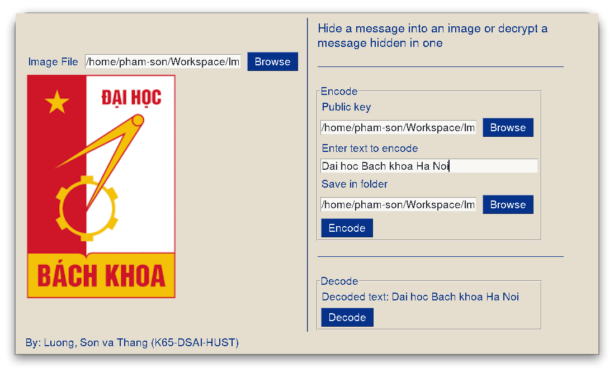

# Image Steganography with RSA Algorithm



This repository contains the source code and documentation for our course project on **Image Steganography with RSA Algorithm**. The project was developed as part of the course "Introduction to Cryptography" in the semester 2021.2.

## Introduction

Image steganography is the practice of concealing secret information within an image, making it appear as a regular image to an observer. Our project focuses on implementing image steganography techniques along with the RSA algorithm for encryption. By combining these two methods, we enable users to exchange secret messages securely using images.

## Features

- **Image Steganography**: The application allows users to hide secret messages within images using steganography techniques.
- **RSA Encryption**: The secret messages are encrypted using the RSA algorithm, providing an additional layer of security.
- **User-friendly Interface**: The app provides an intuitive and user-friendly interface for easy interaction.

## Requirements

To run the application locally, you need to have the following requirements installed on your machine:

- Python 3.8 (Recommended)
- [numpy](https://numpy.org/)
- [opencv_python](https://pypi.org/project/opencv-python/)
- [PySimpleGUI](https://pysimplegui.readthedocs.io/)

You can install the required dependencies using the following command:

```bash
pip install -r requirements.txt
```

## Getting Started

Follow these instructions to get a copy of the project up and running on your local machine for development and testing purposes:

1. Clone the repository:

   ```bash
   git clone https://github.com/khanhluong34/Image-Steganography-with-RSA-algorithm
   ```

2. Install the required dependencies:

   ```bash
   pip install -r requirements.txt
   ```

3. Generate the public and secret keys:

   ```bash
   python generate_keys.py
   ```

   This will generate a pair of public keys and secret keys. The public key is meant to be shared with the friend you want to exchange messages with, and you should also ask your friend to share their public keys with you.

4. Run the application:

   ```bash
   python app.py
   ```

## Usage

The application supports two main use cases: encrypting messages and decrypting messages.

### Encrypting Messages

1. Launch the application by running `app.py`.
2. Select an image to hide a secret message.
3. Select the public key file of your intended recipient.
4. Enter the desired secret message in the provided input field.
5. Select where you want to save the resulting image.
6. Click the "Encode" button.

The application will generate a new image containing the hidden message and save it to the specified location.

### Decrypting Messages

1. Launch the application by running `app.py`.
2. Select the image containing the hidden message that you received from your friend.
3. Click the "Decode" button.

The application will extract the hidden message from the image and decrypt it using RSA. The decrypted message will be displayed in the application.

Note: To successfully decrypt a message, you need to have the corresponding private key that matches the public key used for encryption.

Remember to securely store your private keys and only share the public keys with trusted recipients.

## Team Members

- [Tran Khanh Luong](https://github.com/khanhluong34/)
- [Pham Tien Son](https://github.com/phamson02/)
- Le Tran Thang

## License

This project is licensed under the [MIT License](LICENSE).

## Acknowledgments

We would like to express our gratitude to our instructor [Nguyen Phi Le](https://users.soict.hust.edu.vn/lenp/) for her guidance and support throughout the course. Her valuable insights and feedback have greatly contributed to the success of this project.
